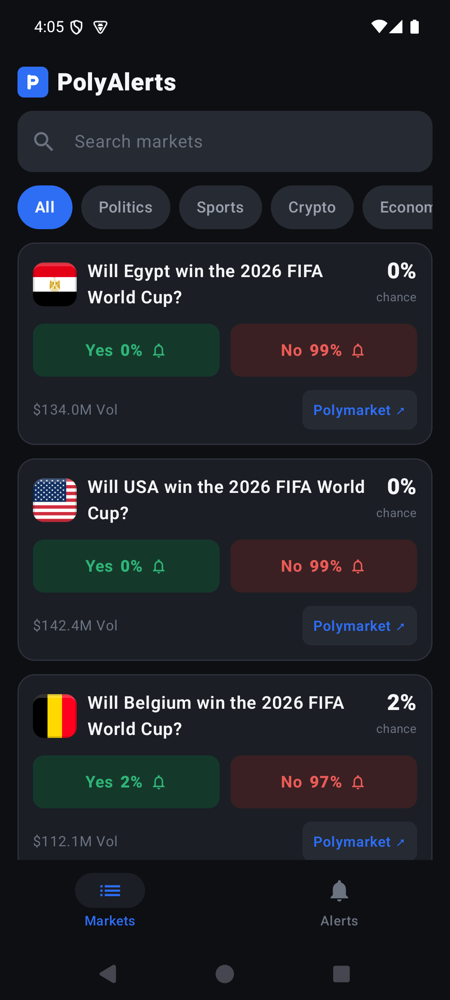
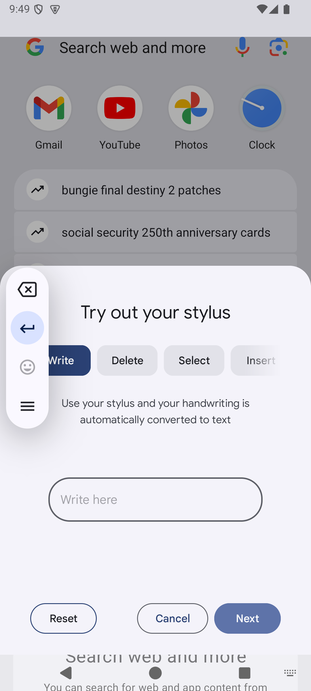
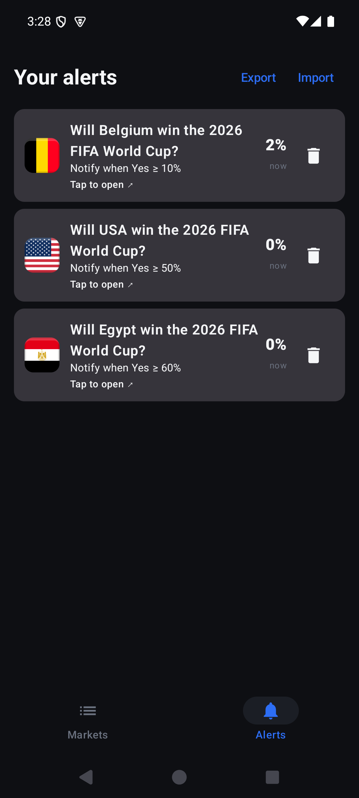

<p align="center">
  
</p>

# PolyAlerts

**A lightweight, private Android app for price & probability alerts on [Polymarket](https://polymarket.com) prediction markets.**
Set a target and get a notification when a market reaches it (checked periodically in the background), then open the official Polymarket site with one tap. No account, no trackers — everything stays on your device.

> ⚠️ **Unofficial.** Independent project — not created by, endorsed by, or affiliated with Polymarket. It only shows public information and sends reminders; it does **not** place bets, hold funds, or process transactions.

## ⬇️ Download

**[Download the latest APK →](https://github.com/privanindivan/polyalerts/releases/latest)**

1. Download `PolyAlerts-vX.Y.Z.apk` from the latest release.
2. Open it on your Android phone and allow installing from this source if prompted.
3. Open PolyAlerts, tap a market, and set an alert.

Requires Android 8.0 (API 26) or newer.

## Screenshots

<p>
  
  
  
</p>

## Features

- 🔔 **Price / probability alerts** — get notified when an outcome reaches a % you choose ("Yes rises to 60%").
- 📉 **Movement alerts** — get notified when an outcome moves by ±X% in either direction.
- 📊 **Live probabilities on your alerts** — the Alerts tab shows each market's current chance, auto-refreshing, and turns green when your target is reached.
- 🔎 **Browse & search** live markets across Politics, Sports, Crypto, Economy, Tech, World, Business and Pop Culture.
- ↗️ **One tap** opens any market on the official Polymarket site.
- 💾 **Export / import** your alerts via QR code to move them between phones — no file, no cloud.

## Private by design

- No account, no sign-up.
- No ads, no trackers, no analytics.
- Alerts are stored **only on your device**.

## Notes

- Alerts are checked periodically in the background; delivery timing depends on your phone's battery/power-saving settings, so they're near-real-time, not instant. Allow the app to run in the background for reliable delivery.
- All market data comes from Polymarket's public API.
- Prediction markets may be restricted in your region — any decision to visit Polymarket and trade is entirely your own.

## Roadmap

- Instant push alerts (foreground service / push backend).
- A separate watch/bookmark list (track odds without setting an alert).
- Mini price trend chart on each market.

## Build from source

1. Open the project in **Android Studio** (Ladybug or newer).
2. Run on a device/emulator with API 26+. Grant the notification permission when asked.

The app is a single-Activity Jetpack Compose app:

```
app/src/main/java/com/polyalerts/
├─ data/    Gamma API (Retrofit) + Room (local alert rules) + Repository
├─ alerts/  notification channel, background price-check worker, scheduler
└─ ui/      Compose screens (Markets / Alerts), ViewModel, theme
```

## Privacy policy

https://privanindivan.github.io/polyalerts-legal/

## License

Licensed under the **GNU General Public License v3.0** — see [LICENSE](LICENSE).
You may use, study, modify, and redistribute this software, but any distributed
derivative must also be released under the GPL-3.0 (it must stay open source).
